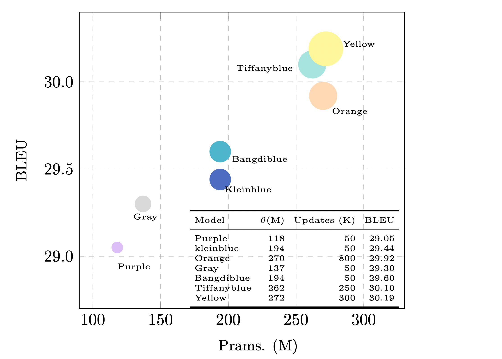
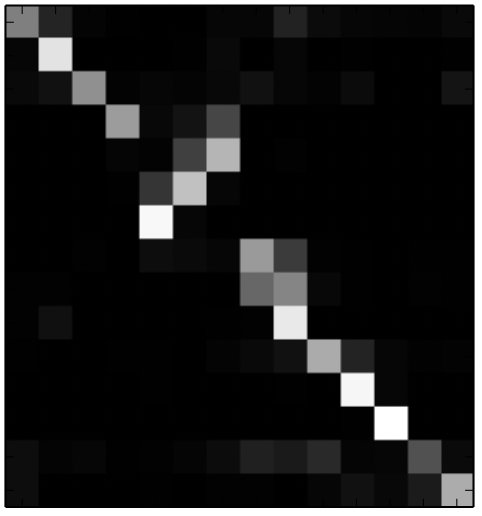

<h1 align="center"> Paper Picture Writing Code</h1>

  <a href="#项目动机">项目动机</a>/
  <a href="#项目简介">项目简介</a>/
  <a href="#参考资源">参考资源</a>/
  <a href="#目录">目录</a>/
  <a href="#注释讲解">注释讲解</a>/
  <a href="#文件夹说明">文件夹说明</a>/
  <a href="#组织者">组织者</a>/
  <a href="#贡献者">贡献者</a>

---

##  项目动机

对于很多科研新手来说论文图片的绘制常常成为论文写作中一大难题，图像失真、图示不合规范等问题会导致论文质量的降低，LaTex原生支持的图包绘制的矢量图具有不会出现失真、便于实时修改和维护等优点，为了帮助一些同学提高论文写作画图的质量和效率、学会更好地利用**LaTex画图**，本项目基于**LaTex**开源论文中常用的**画图代码**，希望能对大家的论文写作图片绘制有所帮助。

>本项目的特色：
>1. **代码开源**：为初学者提供了可学习和可复用的代码样例，方便大家快速入门。
>2. **注释详细**：帮助此项目基础上进一步上手实践，也便于快速定位自己代码中的错误。 
>3. **类别广繁**：涵盖AI论文画图中常用的几类画图代码。

本项目所用徽章来自互联网，如侵犯了您的图片版权请联系我们删除，谢谢。

##  项目简介

本项目目前基于LaTex开源了几种AI论文中常用的画图代码，共包含**折线图**、**柱状图**、**散点图**、**注意力可视化**以及**结构图**五种图，供各位同学参考。此外，附有详细的代码注释讲解，可供同学们进一步学习以及拓展实践。

##  参考资源

##  目录

| 图类别 | 代码                                                       | 贡献者                                                      |
| ---- | ------------------------------------------------------------ | ------------------------------------------------------------ |
|    | [引言]() |  |
|       | [折线图]() |  |
|    | [柱状图]() | |
|     | [散点图]() |  |
|     | [注意力可视化]() |  |
|     | [结构图]() |  |

##  注释讲解

| 代码          | 注释                 | 贡献者                                     |  
| :----------------------------------------------------------- | :----------------------------------------------------------- | ------------------------------------------------------------ |
| | | |

##  文件夹说明

- **imgs**：项目中的图片
- **code**：涉及到的代码

##  组织者
感谢以下同学对本项目的组织

##  贡献者
感谢以下同学对本项目的支持与贡献

