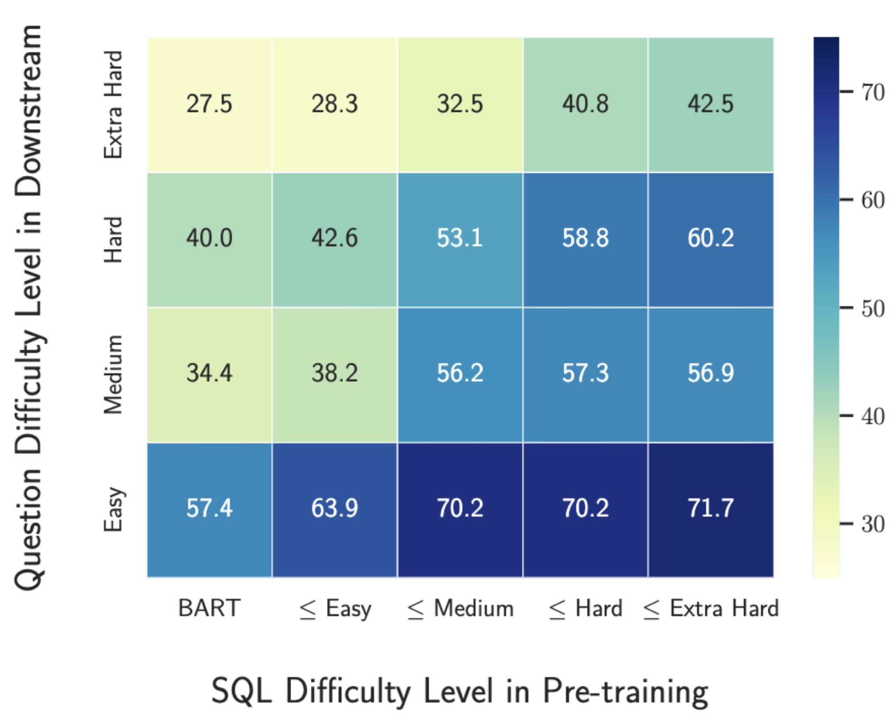
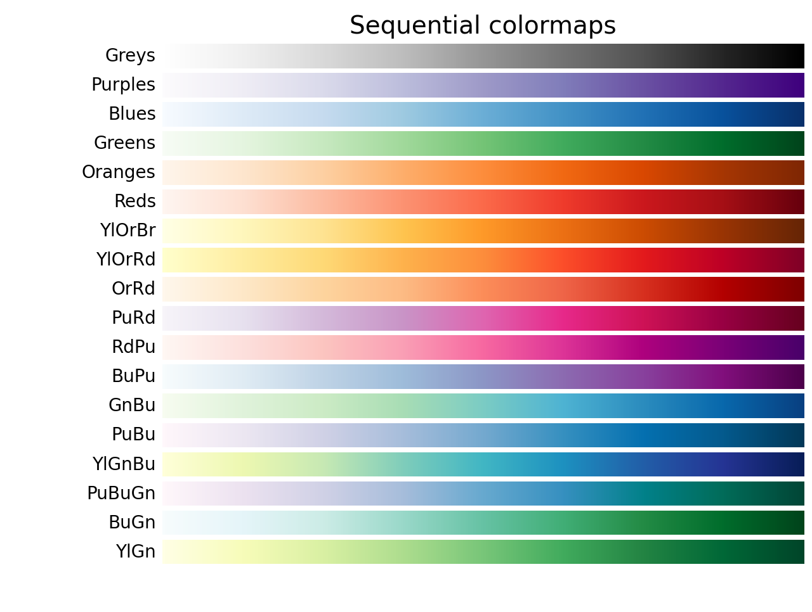

# 如何绘制美妙的注意力矩阵可视化图

<div align=center></div>

本章节主要介绍如何使用`matplotlib`和`seaborn`绘制注意力矩阵的可视化图。 故首先要引用依赖库如下:

```python
import numpy as np
import matplotlib.pyplot as plt
import seaborn as sns
```

如果还未安装上述库，可以通过以下安装指令安装:

```shell
pip install seaborn
```

接下来，首先让我们来初始化一个用于绘制注意力图的矩阵:

```python
data_matrix = np.mat(
    [[27.5, 28.3, 32.5, 40.8, 42.5],
     [40.0, 42.6, 53.1, 58.8, 60.2],
     [34.4, 38.2, 56.2, 57.3, 56.9],
     [57.4, 63.9, 70.2, 70.2, 71.7]]
)
```

> 实际使用时也可以首先通过 `np.save(f, data_matrix)` 将自动计算得到的矩阵存储到文件 `f = open('data.npy', 'wb')` 中，在绘制脚本中使用 `np.load(open('data.npy', 'rb'))` 进行数据读取。

接下来，有些时候我们需要在注意力图的横轴或纵轴使用到Latex的相关语法如 `\textsc`，或者为了与论文中的字体风格更加匹配，可以引入如下定义 (前提是绘图环境中已经成功安装Latex，并配置好了相关的环境变量):

```python
plt.rc('text', usetex=True)
plt.rc('text.latex', preamble=r'\usepackage{lmodern}')
```

接下来，直接使用以下代码进行注意力矩阵的绘制:

```python
fig = sns.heatmap(data_matrix,
                  linewidth=0.5,
                  # 将具体的数字写在对应的表格中，%.1f 指定了样式，在较复杂的样式中可以去掉
                  annot=np.array(['%.1f' % point for point in np.array(data_matrix.ravel())[0]]).reshape(np.shape(data_matrix)),
                  # 这里必须置空，否则会出现问题
                  fmt='',
                  yticklabels=["Extra Hard", "Hard", "Medium", "Easy"],
                  # 如果 usetext=True, 这里可以使用 latex 语法比如 $\leq$ = <
                  xticklabels=["BART", "$\leq$ Easy", "$\leq$ Medium", "$\leq$ Hard", "$\leq$ Extra Hard"],
                  vmax=75.0,
                  vmin=25.0,
                  # cmap 决定了注意力图的色调
                  cmap="YlGnBu")
```

在这里笔者解释一下每个选项的含义:
- `np.array(data_matrix.ravel())[0]` 是为了将矩阵从二维变成一维，把文本依次排列在每个单元格上
- 但当矩阵过大时，一般我们不会显示每个单元格内的具体数字，此时可以将 `annot` 该行去掉
- `yticklabels` 是纵轴从下往上的标签列表，其长度需要与 `data_matrix` 行的数量一样
- `xticklabels` 是横轴从左往右的标签列表，其长度需要与 `data_matrix` 列的数量一样
- `linewidth` 是分隔单元格的线的宽度
- `ymax` 和 `ymin` 分别指定了色系两端对应的值
- `cmap` 是注意力图的色系，推荐以下选择



最后，给纵轴和横轴分别写上对应的标签:

```python
plt.ylabel("Question Difficulty Level in Downstream", labelpad=25)
plt.xlabel("SQL Difficulty Level in Pre-training", labelpad=25)
```

即可调整布局并保存成用在论文中的格式:

```python
# 调整布局至合适的位置
plt.tight_layout()
# 保存文件
plt.savefig('attention.pdf')
```
